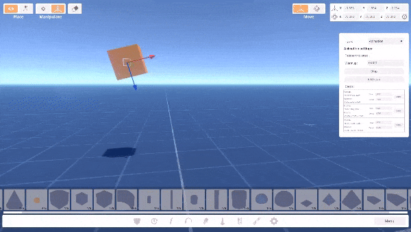
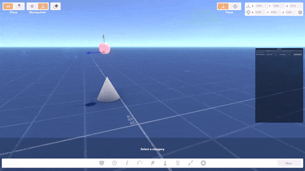
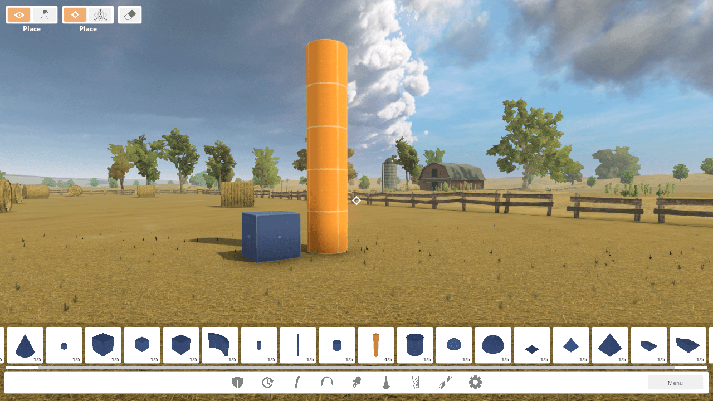

# Liftoff MovingObjects Mod

> **Warning!** This project is not official and is not supported by Liftoff game developers!

Mod for Liftoff game to extend functionality of the track editor.

## Features

### Object animation
Adds step-by-step animation for objects

### Physics

Adds physics to objects

### Unlock blueprint object

Allow to place objects from the Blueprint map on any map

## Installation

 1. Open game directory (Steam -> Manage -> Browse local files)
 2. Download [BepInEx 5.4.22](https://github.com/BepInEx/BepInEx/releases/download/v5.4.22/BepInEx_x64_5.4.22.0.zip) and extract to game folder
 3. Download latest [Liftoff.MovingObjects release](https://github.com/ps-hek/Liftoff.MovingObjects/releases/latest) and extract to game folder
